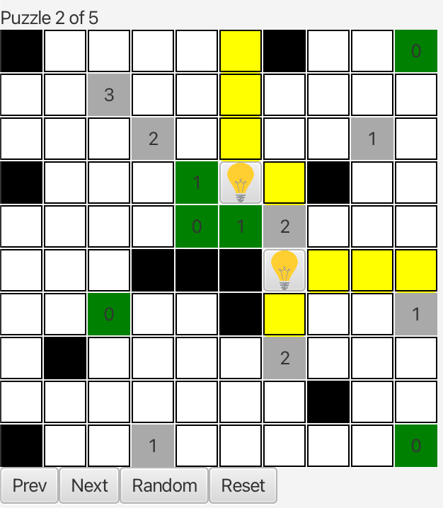

# Light-Up

To run the game:

1. Run the following command in cli w/ file path:
   
   ``` java -jar LightUp.jar

To win:

1. Place light bulbs in white cells such that the entire grid is lit up

2. No two bulbs may shine on each other

3. Clue cells indicate how many bulbs must be placed adjacent to its four sides


